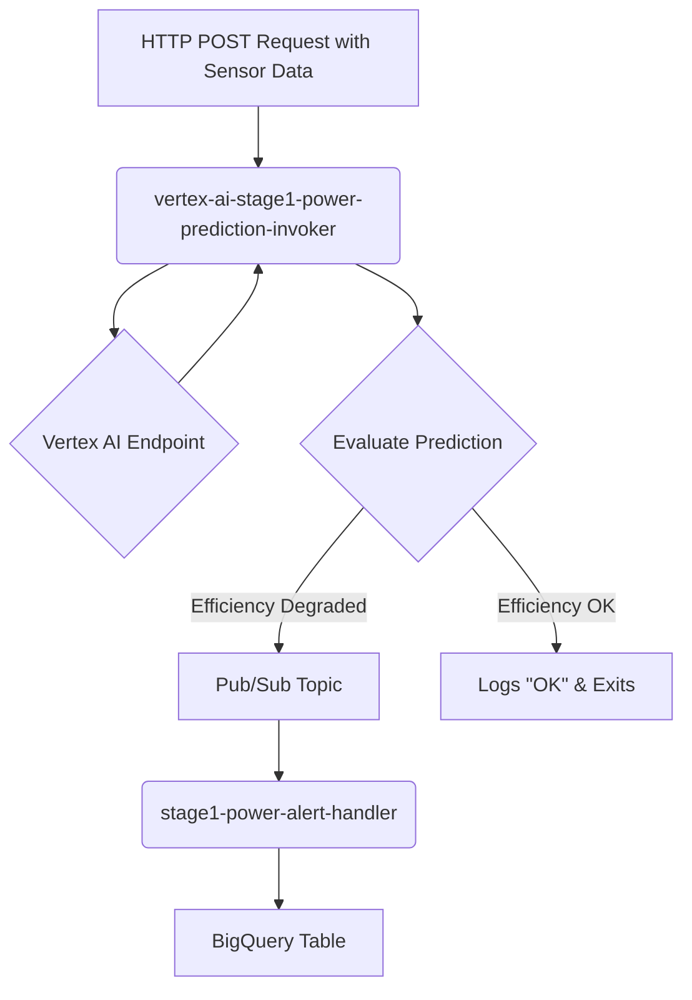

# Cloud Functions for Real-Time Prediction and Alerting

## 📌 Overview

This directory contains the serverless components of the CEMint project, designed to create a reactive pipeline for real-time inference, analysis, and alerting. These functions bridge the gap between incoming plant data and actionable insights stored in our data warehouse.

The primary workflow demonstrated here is for **Stage 1: Raw Material Power Consumption**.

---

## 🏗️ Architecture

The functions work in sequence to process data, get a prediction, evaluate it, and store alerts.



1.  A client sends real-time sensor data via an HTTP POST request to the `prediction-invoker` function.
2.  The `prediction-invoker` calls a deployed Vertex AI model to get a power efficiency prediction.
3.  It analyzes the prediction. If efficiency is found to be degrading (i.e., the predicted value crosses a threshold), it publishes an alert message to a Pub/Sub topic.
4.  The `alert-handler` service, subscribed to this topic, receives the alert.
5.  The `alert-handler` writes the alert data into a BigQuery table for permanent storage and future analysis.
6.  The same `pub-sub` topic will be registered by Firebase cloud function also which send this data to Firebase Realtime Database for updation in Web UI.


---

## 📁 Subdirectories

### 1. `vertex-ai-stage1-power-prediction-invoker`

This Cloud Function is the entry point for real-time predictions.

-   **Purpose**: To invoke a Vertex AI model for power efficiency prediction and trigger alerts on degradation.
-   **Trigger**: HTTP POST Request.
-   **Core Logic**:
    1.  Receives a JSON payload with sensor readings (see `Current_Data.json` for an example).
    2.  Calls the configured Vertex AI prediction endpoint.
    3.  Evaluates the prediction against a hardcoded threshold (e.g., `predicted_value > 1.5`).
    4.  If the threshold is breached, it publishes a detailed alert to a Pub/Sub topic.
-   **Environment Variables**:
    -   `GCP_PROJECT`: Your Google Cloud Project ID.
    -   `GCP_REGION`: The region where the resources are deployed (e.g., `us-central1`).
    -   `VERTEX_AI_ENDPOINT_ID`: The numerical ID of the deployed Vertex AI Endpoint.
    -   `VERTEX_AI_MODEL_ID`: The ID of the model associated with the endpoint.
    -   `PUB_SUB_TOPIC_ID`: The ID of the Pub/Sub topic for publishing alerts.
-   **Data published on Pub/Sub Topic**:
    The function publishes a JSON payload to the Pub/Sub topic with the following structure:
    ```json
    {
        "timestamp": "2025-01-25 23:30:00+0000",
        "model_id": "8459566597806227456",
        "endpoint_id": "3369918476738101248",
        "alert_type": "power_efficiency_degradation",
        "message": "Power Consumption Efficiency degraded!!! Value : 1.598168611526489 ",
        "suggestion": "Decrease the Crusher Power or add more raw materials(limestone, clay or iron ore)"
    }
    ```

#### Testing

You can test this function using `curl` by sending a POST request with the appropriate JSON payload.

```sh
# Set your Cloud Function URL
FUNCTION_URL="YOUR_CLOUD_FUNCTION_URL"
#(FUNCTION_URL="https://vertex-ai-stage1-power-prediction-invoker-281514236748.us-central1.run.app/")

# --- Test Case 1: Payload that triggers an alert ---
curl -X POST $FUNCTION_URL \
-H "Content-Type: application/json" \
-d '{
    "instances": [
      {
        "timestamp":"2025-01-25 23:30:00+0000",
        "limestone_feed_tph":200,
        "clay_feed_tph":40,
        "iron_ore_feed_tph":6.14,
        "gypsum_feed_tph":5.93,
        "laterite_feed_tph":2.9,
        "limestone_moisture_pct":4.64,
        "clay_moisture_pct":8.85,
        "avg_particle_size_mm":20.24,
        "CaO_pct":43.12,
        "SiO2_pct":13.94,
        "Al2O3_pct":4.07,
        "Fe2O3_pct":3.43,
        "MgO_pct":0.51,
        "crusher_power_kw":700,
        "conveyor_speed_mps":1.77,
        "CO2_emission_kgph":249.33,
        "dust_concentration_mgpm3":33.86,
        "crusher_status":"0",
        "energy_consumption_kwh":178.63,
        "moisture_content_pct":10.59,
        "plantIDs":"Plant00",
        "total_feed_tph":344.33,
        "energy_per_ton_processed":0.5187755931809601,
        "total_moisture_load":1857.6208,
        "avg_particle_size_squared":409.65759999999995,
        "cao_sio2_ratio":3.0932568149210904,
        "al2o3_fe2o3_ratio":1.1865889212827989,
        "prev_crusher_power_kw":360.75,
        "prev_co2_emission_kgph":172.92,
        "prev_total_feed_tph":416.88000000000005
      }
    ]
  }'

# --- Test Case 2: Payload that does NOT trigger an alert ---
curl -X POST $FUNCTION_URL \
-H "Content-Type: application/json" \
-d '{
    "instances": [
      {
        "timestamp":"2025-01-25 23:30:00+0000",
        "limestone_feed_tph":250,
        "clay_feed_tph":65.5,
        "iron_ore_feed_tph":6.14,
        "gypsum_feed_tph":5.93,
        "laterite_feed_tph":2.9,
        "limestone_moisture_pct":4.64,
        "clay_moisture_pct":8.85,
        "avg_particle_size_mm":20.24,
        "CaO_pct":43.12,
        "SiO2_pct":13.94,
        "Al2O3_pct":4.07,
        "Fe2O3_pct":3.43,
        "MgO_pct":0.51,
        "crusher_power_kw":340,
        "conveyor_speed_mps":1.77,
        "CO2_emission_kgph":249.33,
        "dust_concentration_mgpm3":33.86,
        "crusher_status":"0",
        "energy_consumption_kwh":178.63,
        "moisture_content_pct":10.59,
        "plantIDs":"Plant00",
        "total_feed_tph":344.33,
        "energy_per_ton_processed":0.5187755931809601,
        "total_moisture_load":1857.6208,
        "avg_particle_size_squared":409.65759999999995,
        "cao_sio2_ratio":3.0932568149210904,
        "al2o3_fe2o3_ratio":1.1865889212827989,
        "prev_crusher_power_kw":360.75,
        "prev_co2_emission_kgph":172.92,
        "prev_total_feed_tph":416.88000000000005
      }
    ]
  }'
```

### 2. `stage1-power-alert-handler`

This service acts as a sink, listening for alerts and logging them.

-   **Purpose**: To receive power degradation alerts from Pub/Sub and store them in BigQuery.
-   **Trigger**: Pub/Sub Push Subscription.
-   **Core Logic**:
    1.  Receives a push message from its subscribed Pub/Sub topic.
    2.  Decodes the Base64-encoded message data to retrieve the JSON alert payload.
    3.  Inserts the JSON data as a new row into the configured BigQuery table.
-   **Environment Variables**:
    -   `GCP_PROJECT_ID`: Your Google Cloud Project ID.
    -   `BIGQUERY_DATASET_ID`: The BigQuery dataset where the alerts table resides (e.g., `cementAI_syn_data_stage1`).
    -   `BIGQUERY_TABLE_ID`: The BigQuery table for storing alerts (e.g., `Power_Eff_Degradation_Triggers`).

### 3. `vertex-at-stage1-power-prediction-invoker-XAI` (IN PROGRESS)

This is an advanced implementation of the prediction invoker that leverages **Vertex Explainable AI (XAI)**.

-   **Purpose**: To get both a prediction and an explanation for the model's output, providing deeper insights into why an alert was triggered.
-   **Trigger**: HTTP POST Request.
-   **Core Logic**:
    1.  Receives a JSON payload with sensor readings.
    2.  Calls the `explain()` method on the configured Vertex AI endpoint.
    3.  The response contains both the `prediction` and the `explanations` (feature attributions).
    4.  It processes the prediction to evaluate if efficiency is degraded.
    5.  If degraded, it publishes an alert to Pub/Sub. The feature attributions are logged but can be added to the alert payload for more context.
-   **Benefit**: The feature attributions explain *why* the model made a certain prediction (e.g., "high `crusher_power_kw` was the main contributor to the high efficiency loss prediction"). This data is invaluable for operators to take precise corrective actions.

---

## 🚀 Deployment

These functions are designed to be deployed on Google Cloud as:
-   **2nd Gen Cloud Functions**: For both `prediction-invoker` and `alert-handler`.
-   **Cloud Run**: The `alert-handler` can also be deployed as a Cloud Run service with a Pub/Sub push subscription as its trigger.

Configuration is managed via environment variables set during deployment.
